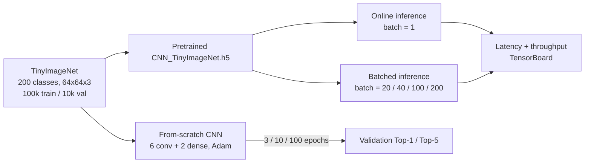

# dnn-gpu-training-tinyimagenet

Training a CNN from scratch on TinyImageNet, then profiling how its inference latency and
throughput behave under single-image vs. batched execution on an NVIDIA GPU.


CprE 487/587 (Iowa State University) lab. Co-authored with **Owen Parker** — see
[Contributors](#contributors).

---

## What this is

Two separate questions, both on the [TinyImageNet](https://github.com/ksachdeva/tiny-imagenet-tfds)
dataset (200 classes, 100,000 training / 10,000 validation images, 64×64×3):

1. **Given a model, how fast can you run it?** A provided pretrained model
   (`CNN_TinyImageNet.h5`) is loaded and profiled under single-image ("online") inference and
   batched inference at several batch sizes.
2. **What does it take to train one?** A CNN is built and trained from scratch for 3, 10, and 100
   epochs to see how validation accuracy actually moves with training length.

## Pipeline



## Results

### Pretrained model, inference accuracy (9,984 validation samples)

| Metric | Value |
|---|--:|
| Top-1 | 24.29% |
| Top-5 | 49.34% |
| Top-10 | 61.70% |

### Pretrained model, inference throughput

| Mode | Images | Total latency | Throughput |
|---|--:|--:|--:|
| Online (batch=1) | 10 | 1,484.75 ms | 6.74 img/sec |
| Online (batch=1) | 100 | 13,264.76 ms | 7.54 img/sec |
| Online (batch=1) | 1,000 | 116,045.92 ms | 8.62 img/sec |
| Batched | 1,000 @ batch 20 | 16,495.81 ms | 60.62 img/sec |
| Batched | 1,000 @ batch 40 | 13,085.79 ms | 76.42 img/sec |
| Batched | 1,000 @ batch 100 | 11,134.32 ms | 89.81 img/sec |
| Batched | 1,000 @ batch 200 | 9,952.93 ms | 100.47 img/sec |

Batching amortizes per-call overhead and gives the GPU actual parallel work to do; online
inference processes one image per call and stays latency-bound regardless of how many images you
send it.

### From-scratch training: `Conv2D×6 → MaxPool×3 → Dense(256) → Dense(200, softmax)`

| Epochs | Final val Top-1 | Final val Top-5 |
|--:|--:|--:|
| 3 | 0.50% | 2.50% |
| 10 | 0.50% | 2.50% |
| 100 | 16.42% | 37.86% |

At 3 and 10 epochs the model hasn't escaped near-random performance yet (1/200 = 0.5% is chance
level). By 100 epochs it's learning real structure, but the accompanying lab report notes
validation accuracy peaked earlier in the run and partially degraded afterward — the model starts
overfitting well before 100 epochs on TinyImageNet's 500-images-per-class training set.

## Repository layout

```
dnn-gpu-training-tinyimagenet/
├── lab1_notebook_rafat_momin_owen_parker.ipynb   All code: dataset, inference, profiling, training
├── lab1_report_rafat_momin_owen_parker.pdf       Written analysis and discussion
└── lab1_binaries_rafat_momin_owen_parker/        3 exported validation images (flattened binary + metadata)
```

## Build & run

Requires TensorFlow with GPU support, `tensorflow-datasets`, and the
[`tiny_imagenet`](https://github.com/ksachdeva/tiny-imagenet-tfds) dataset loader. The pretrained
`CNN_TinyImageNet.h5` used for the inference/profiling sections is not included in this repo (it
was distributed separately via the course) — place it alongside the notebook before running the
"Model Loading and Inference" cells. Open
`lab1_notebook_rafat_momin_owen_parker.ipynb` and run top to bottom; `tensorflow_datasets` caches
the TinyImageNet conversion after the first run.

## Limitations & next steps

- The from-scratch training run at 100 epochs overfits (per the report's own analysis) — no
  regularization (dropout, augmentation, weight decay) was used in the training loop shown here.
- Throughput numbers are from one profiling pass, not averaged over multiple runs — useful as a
  directional result (batching helps a lot), not a precision benchmark.
- The pretrained model's accuracy (Top-1 24.29%) and the from-scratch model's accuracy (Top-1
  16.42% at 100 epochs) aren't directly comparable — different architectures/training runs — but
  the gap is a reasonable prompt for a follow-up: how much of that difference is epochs vs.
  architecture vs. regularization.

## Contributors

- **Rafat Momin**
- **Owen Parker**
